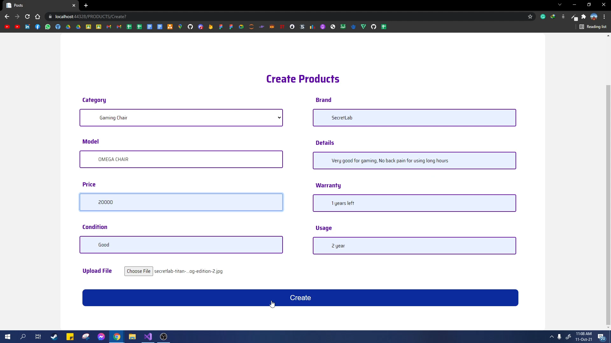

Switch And Shift
=============================

Description
------------

The number of gamers has been increasing rapidly all over the world. This has been fueled up by the current pandemic which has compelled everyone to stay in-door. To get rid of boredom, people have started playing games which increased the demand for gaming products. So, we are coming up with an e-commerce website for
gamers. Through this website, we will help users to connect with each other so that they can buy and sell their gaming products which includes Cds, gaming parts like controllers, mechanical keyboards, gaming headphones etc. We are providing searching options based on various things like which gaming console, location, budget etc which will help them find their required products at ease. Our primary target is to make trading of gaming
Cds, and parts convenient.

- Project Goals: 

  * User can open account and login.
  * Users will be able to buy and sell gaming based products : 
    * Gaming Cds (For xbox, PS4, PS5 etc).
    * Devices like PS4 controllers, mechanical keyboards etc.
    * Buying and selling Credits, keys etc.
  * The website will have search options based on :
    * Locations
    * Consoles
    * Budget
    * Products
  * Admin Panel:
    * Controls user information
  * User Reviews

Platform Information
---------------

 * Language: C#
 * Database: MSSQL
 * IDE: Visual Studio 2019
 * Framework: ASP.NET Core MVC 5

Future Implementations
---------------
- Add chatting app for users

**Video Demonstration** - https://youtu.be/qQ_XRj741OA

ScreenShots
---------------

